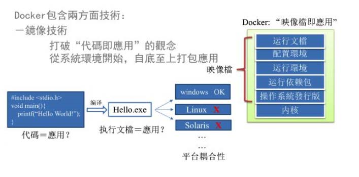
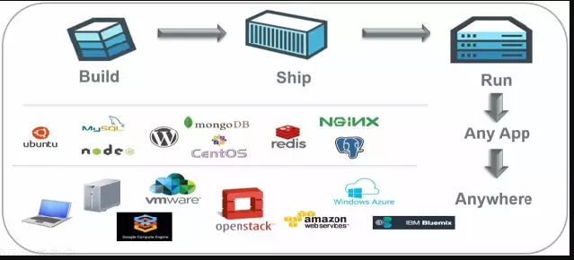
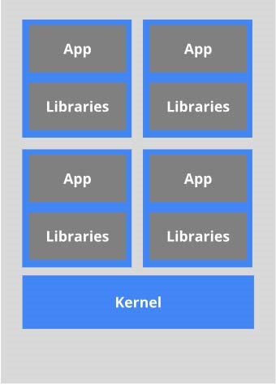
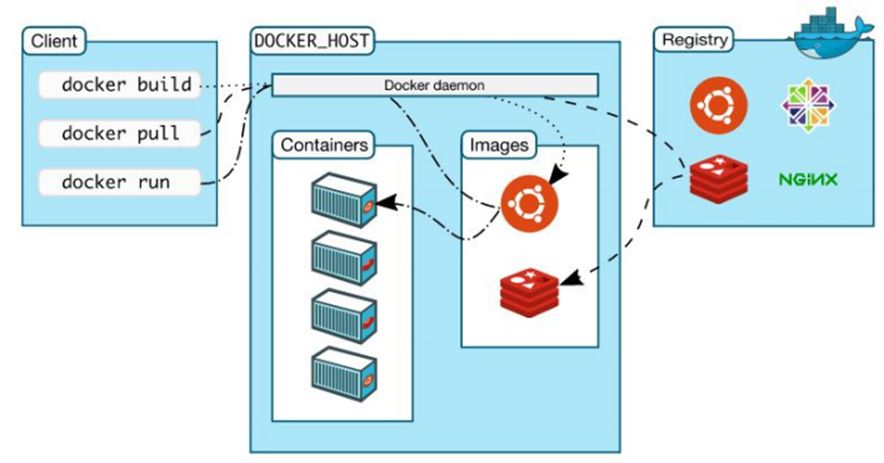

# docker的相关背景知识介绍

## docker的概念

一款产品从开发到上线，从操作系统，到运行环境，再到应用配置。作为开发+运维之间的协作我们需要关心很多东西，这也是很多互联网公司都不得不面对的问题，特别是各种版本的迭代之后，不同版本环境的兼容，对运维人员都是考验
Docker之所以发展如此迅速，也是因为它对此给出了一个标准化的解决方案。
环境配置如此麻烦，换一台机器，就要重来一次，费力费时。很多人想到，能不能从根本上解决问题，软件可以带环境安装？也就是说，安装的时候，把原始环境一模一样地复制过来。开发人员利用 Docker 可以消除协作编码时“在我的机器上可正常工作”的问题。

 

之前在服务器配置一个应用的运行环境，要安装各种软件，就拿尚硅谷电商项目的环境来说吧，Java/Tomcat/MySQL/JDBC驱动包等。安装和配置这些东西有多麻烦就不说了，它还不能跨平台。假如我们是在 Windows 上安装的这些环境，到了 Linux 又得重新装。况且就算不跨操作系统，换另一台同样操作系统的服务器，要移植应用也是非常麻烦的。

传统上认为，软件编码开发/测试结束后，所产出的成果即是程序或是能够编译执行的二进制字节码等(java为例)。而为了让这些程序可以顺利执行，开发团队也得准备完整的部署文件，让维运团队得以部署应用程式，开发需要清楚的告诉运维部署团队，用的全部配置文件+所有软件环境。不过，即便如此，仍然常常发生部署失败的状况。
**Docker镜像的设计，使得Docker得以打破过去「程序即应用」的观念。透过镜像(images)将作业系统核心除外，运作应用程式所需要的系统环境，由下而上打包，达到应用程式跨平台间的无缝接轨运作。**

Docker是基于Go语言实现的云开源项目。

Docker的主要目标是“Build，Ship and Run Any App,Anywhere”，也就是通过对应用组件的封装、分发、部署、运行等生命周期的管理，使用户的APP（可以是一个WEB应用或数据库应用等等）及其运行环境能够做到“一次封装，到处运行”。

Linux 容器技术的出现就解决了这样一个问题，而 Docker 就是在它的基础上发展过来的。将应用运行在 Docker 容器上面，而 Docker 容器在任何操作系统上都是一致的，这就实现了跨平台、跨服务器。
**只需要一次配置好环境，换到别的机子上就可以一键部署好，大大简化了操作**

简单来说：

docker 解决了运行环境和应用的配置问题的软件容器,简化了做持续集成，并有助于软件整体打包和发布的容器虚拟机化技术。

## 与虚拟机的对比

虚拟机（virtual machine）就是带环境安装的一种解决方案。
它可以在一种操作系统里面运行另一种操作系统，比如在Windows 系统里面运行Linux 系统。应用程序对此毫无感知，因为虚拟机看上去跟真实系统一模一样，而对于底层系统来说，虚拟机就是一个普通文件，不需要了就删掉，对其他部分毫无影响。这类虚拟机完美的运行了另一套系统，能够使应用程序，操作系统和硬件三者之间的逻辑不变。  

虚拟机的缺点：

| 编号 | 描述             |
| ---- | ---------------- |
| 1    | 系统资源消耗大    |
| 2    | 操作步骤冗长烦琐  |
| 3    | 启动系统慢        |

## 容器虚拟化技术的概念

由于前面虚拟机存在这些缺点，Linux 发展出了另一种虚拟化技术：Linux 容器（Linux Containers，缩写为 LXC）。
Linux 容器不是模拟一个完整的操作系统，而是对进程进行隔离。有了容器，就可以将软件运行所需的所有资源打包到一个隔离的容器中。容器与虚拟机不同，不需要捆绑一整套操作系统，只需要软件工作所需的库资源和设置。系统因此而变得高效轻量并保证部署在任何环境中的软件都能始终如一地运行。

 

比较了 Docker 和传统虚拟化方式的不同之处：

*传统虚拟机技术是虚拟出一套硬件后，在其上运行一个完整操作系统，在该系统上再运行所需应用进程
而容器内的应用进程直接运行于宿主的内核，容器内没有自己的内核，而且也没有进行硬件虚拟。因此容器要比传统虚拟机更为轻便。*

每个容器之间互相隔离，每个容器有自己的文件系统 ，容器之间进程不会相互影响，能区分计算资源。

目前国内外大量的企业，都在使用docker相关技术来提供分布式的，微服务化的服务来解决企业的业务需求。

大家可自行搜索查询，也可以关注docker中国社区的微信公众号来查看相关的企业成功案例分享。

## docker的资源网站

[官网](https://www.docker.com/)

[中文官网](https://www.docker-cn.com/)

[docker仓库](https://hub.docker.com/)

## docker的相关概念

1. 镜像（image）
2. 容器（container）
3. 仓库（repository）

下面进行详细说明

### 镜像

Docker 镜像（Image）就是一个只读的模板。镜像可以用来创建 Docker 容器，一个镜像可以创建很多容器。

镜像与容器的关系举例

| docker | 面向对象开发             |
| ---- | ---------------- |
| 镜像    | 类        |
| 容器    | 对象      |

### 容器

Docker 利用容器（Container）独立运行的一个或一组应用。容器是用镜像创建的运行实例。

它可以被启动、开始、停止、删除。每个容器都是相互隔离的、保证安全的平台。

**可以把容器看做是一个简易版的 Linux 环境**（包括root用户权限、进程空间、用户空间和网络空间等）和运行在其中的应用程序。

容器的定义和镜像几乎一模一样，也是一堆层的统一视角，唯一区别在于容器的最上面那一层是可读可写的。

### 仓库

仓库（Repository）是集中存放镜像文件的场所。
仓库(Repository)和仓库注册服务器（Registry）是有区别的。仓库注册服务器上往往存放着多个仓库，每个仓库中又包含了多个镜像，每个镜像有不同的标签（tag）。

仓库分为公开仓库（Public）和私有仓库（Private）两种形式。
最大的公开仓库是 [Docker Hub](https://hub.docker.com/),
存放了数量庞大的镜像供用户下载。国内的公开仓库包括阿里云 、网易云 等

类似于github的概念

### 小结

要正确的理解仓储/镜像/容器这几个概念:

Docker 本身是一个容器运行载体或称之为管理引擎。我们把应用程序和配置依赖打包好形成一个可交付的运行环境，这个打包好的运行环境就似乎 image镜像文件。只有通过这个镜像文件才能生成 Docker 容器。image 文件可以看作是容器的模板。Docker 根据 image 文件生成容器的实例。同一个 image 文件，可以生成多个同时运行的容器实例。

* image 文件生成的容器实例，本身也是一个文件，称为镜像文件。
* 一个容器运行一种服务，当我们需要的时候，就可以通过docker客户端创建一个对应的运行实例，也就是我们的容器
* 至于仓储，就是放了一堆镜像的地方，我们可以把镜像发布到仓储中，需要的时候从仓储中拉下来就可以了。

