# docker的安装

docker按照官方文档的操作步骤，安装非常简单

以centos为例

[docker安装的官方指南](https://docs.docker.com/install/linux/docker-ce/centos/)

不过前提是，大家对英语有一定的敏感度，可以流畅的阅读文档为前提。

因为docker出现的时间比较晚，大概是2013年左右出现的，
所以对linux的内核有一点给的要求。
最低为centos6.5以上的版本，最好是centos7.0以上的版本为主

本教程以centos7.4 为例进行安装讲解。

默认使用root管理员用户来测试使用docker。

```shell
[root@c01 ~]# cat /etc/centos-release
CentOS Linux release 7.4.1708 (Core)
```

yum 安装gcc和gcc-c++ 编译器相关

```shell
yum -y install gcc
yum -y install gcc-c++
```

简单总结一下就是:

1. 删除系统中旧版本的docker
2. 安装依赖的工具包
3. 添加docker的仓库源
4. 安装docker-ce 社区版本的最新版本
5. 验证是否安装成功
6. 配置镜像加速

下面就分别进行详细说明

## 删除系统中旧版本的docker

```shell
yum remove docker \
                  docker-client \
                  docker-client-latest \
                  docker-common \
                  docker-latest \
                  docker-latest-logrotate \
                  docker-logrotate \
                  docker-engine
```

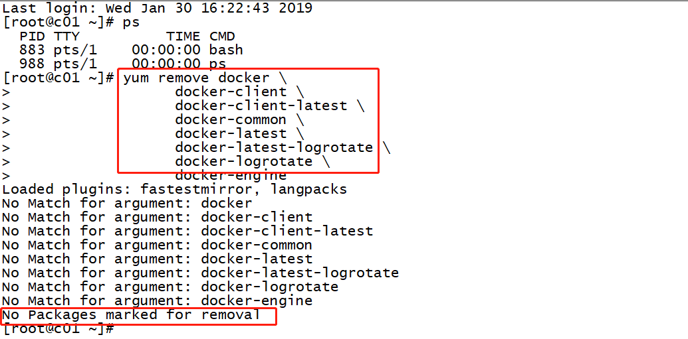

## 安装依赖的工具包

```shell
yum install -y yum-utils \
  device-mapper-persistent-data \
  lvm2
```

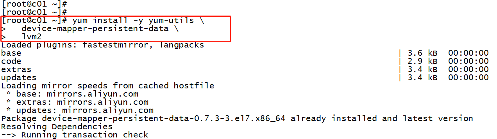

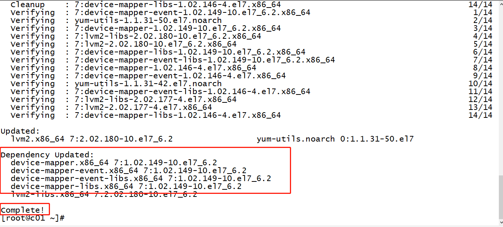

## 添加docker的仓库源

```shell
yum-config-manager \
    --add-repo \
    https://download.docker.com/linux/centos/docker-ce.repo
```

>这里有一个小小的坑
>
>因为docker 是在国外的服务器上面托管着
>所以在国内访问会很慢，并且在安装docker中，会提示网络连接超时。
>所以，国内的用户，需要修改一下，数据源。

aliyun的源

```shell
yum-config-manager \
    --add-repo \
    https://mirrors.aliyun.com/docker-ce/linux/centos/docker-ce.repo
```

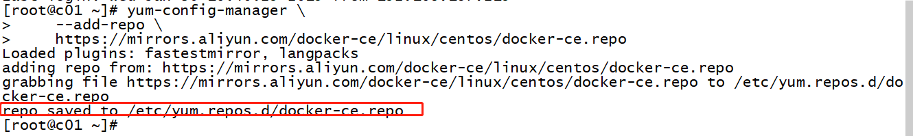

## 安装docker-ce 社区版本的最新版本

更新 yum 软件源缓存,并安装 docker-ce。

```shell
yum makecache fast
yum install docker-ce
```

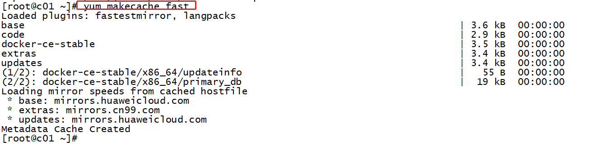

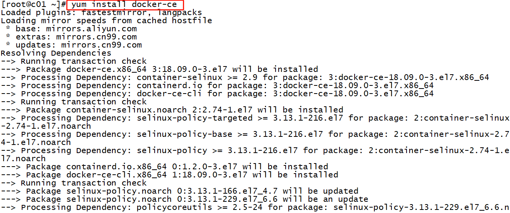

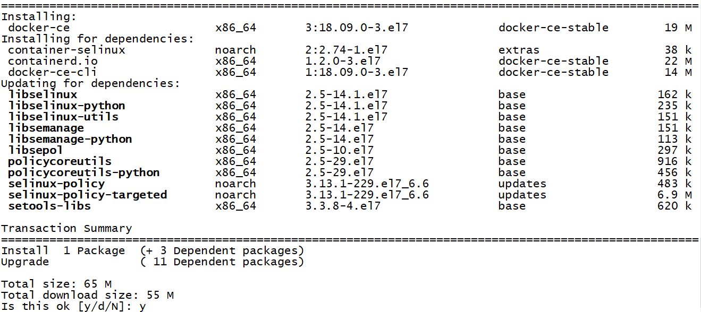

## 验证是否安装成功

启动 Docker CE

```shell
systemctl start docker
systemctl stop docker
systemctl restart docker
```

使用docker运行hello-world镜像进行测试

```shell
docker info
docker run -it hello-world

```

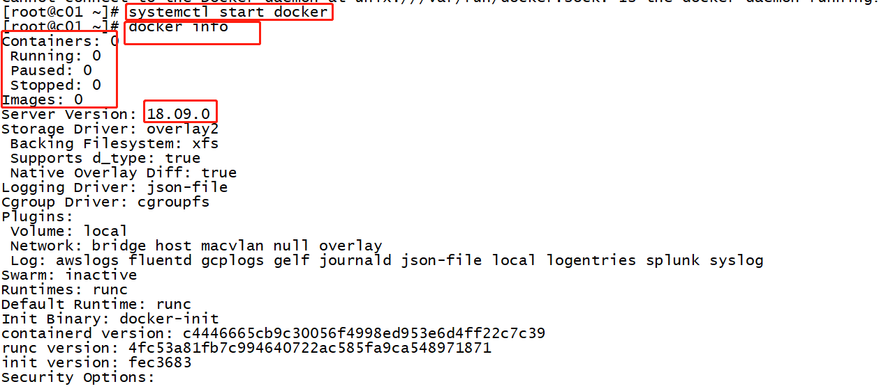

>Unable to find image 'hello-world:latest' locally
docker: Error response from daemon: Get <https://registry-1.docker.io/v2/>: net/http: request canceled while waiting for connection (Client.Timeout exceeded while awaiting headers).
See 'docker run --help'.

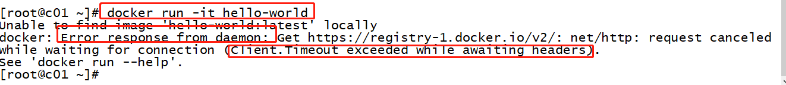

## 配置镜像加速

因为docker，以及docker-hub都搭建在国外，从服务器上面下载镜像会比较慢，所以常见的操作是，配置镜像加速

docker-ce 版本

添加一个docker的镜像配置文件daemon.json

位置在 /etc/docker/daemon.json

如果该位置不存在该文件，就重新创建一个daemon.json 文件即可。

```shell
{
  "registry-mirrors": ["https://你自己的阿里云镜像加速器的id.mirror.aliyuncs.com","http://hub-mirror.c.163.com","https://registry.docker-cn.com"]
}
```

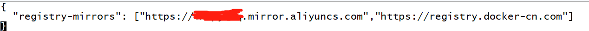

也是可以配置多个地址的。

添加完镜像加速器后，重新加载配置，并重启docker

```shell
systemctl daemon-reload
systemctl restart docker
```


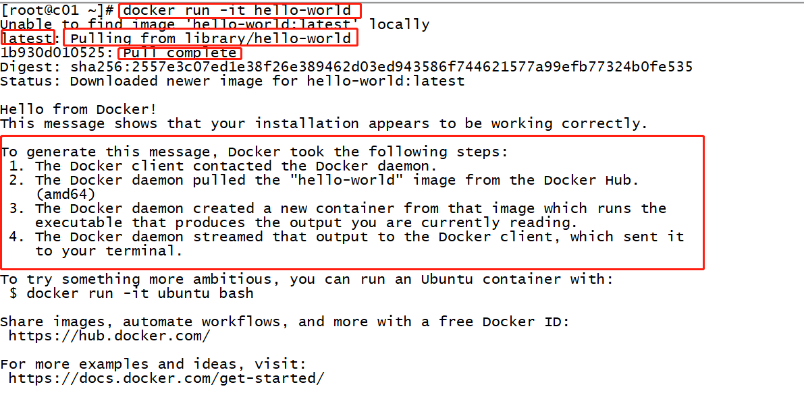

## 7. 卸载docker

当然有安装，就会有卸载

```shell
systemctl stop docker
yum -y remove docker-ce
rm -rf /var/lib/docker
```