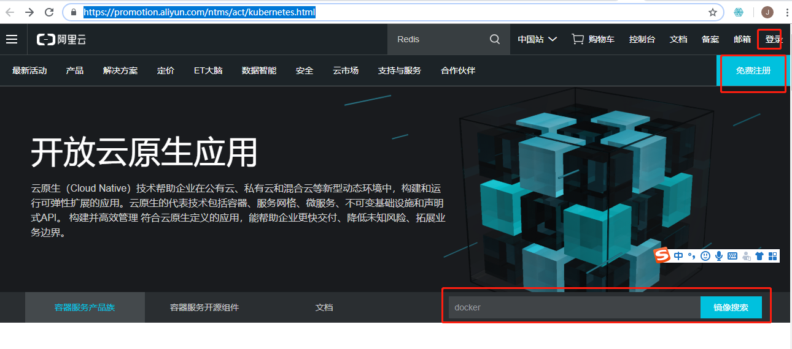
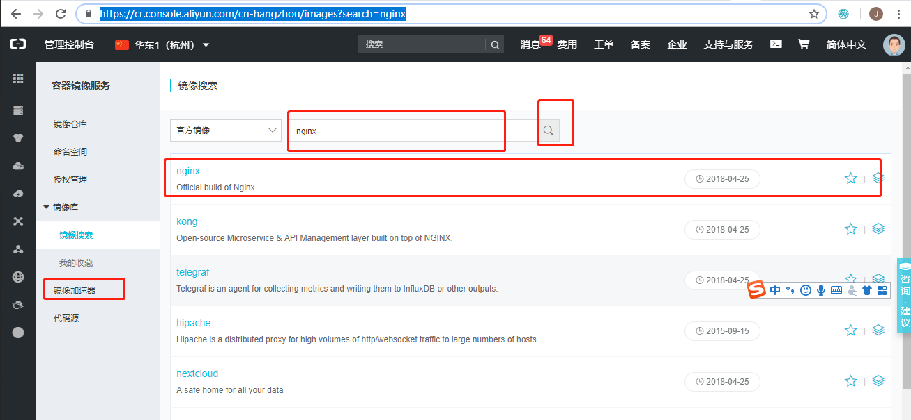
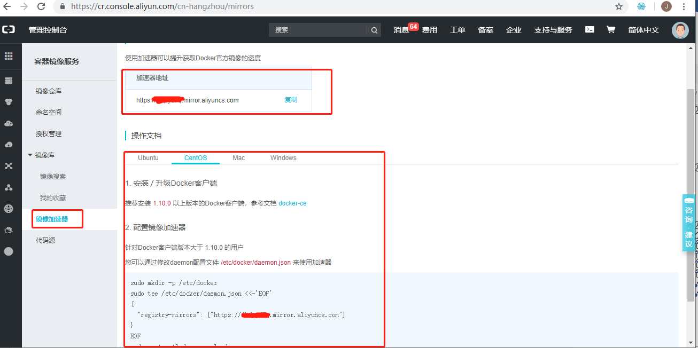
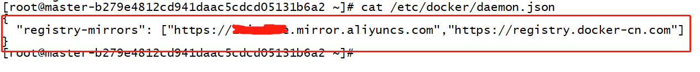

# docker 加速器设置

## 阿里云的镜像加速器配置

[阿里云](https://promotion.aliyun.com/ntms/act/kubernetes.html)

当然要注册一个阿里云的账号了，不过也可以使用支付宝账号sso登录关联授权即可，此步骤略。





镜像加速器地址



其他加速器也可以比如 网易云镜像加速器 <http://hub-mirror.c.163.com>。

还有docker-cn中国镜像加速器
<https://registry.docker-cn.com>

使用vi or vim进行配置

`vi /etc/docker/daemon.json`

输入如下内容：

```shell
{
  "registry-mirrors": ["https://自己阿里云专属的镜像加速器id.mirror.aliyuncs.com","https://registry.docker-cn.com"]
}
```



记得要重新启动docker，以便配置的加速器生效。否则从仓库拉取镜像的时候，可能会连接网络超时。

```shell
systemctl daemon-reload
systemctl restart docker
```

## 测试 hello-world

```shell
docker run -it hello-world

```

输出内容：

```shell
Unable to find image 'hello-world:latest' locally
latest: Pulling from library/hello-world
1b930d010525: Pull complete
Digest: sha256:2557e3c07ed1e38f26e389462d03ed943586f744621577a99efb77324b0fe535
Status: Downloaded newer image for hello-world:latest

Hello from Docker!
This message shows that your installation appears to be working correctly.

To generate this message, Docker took the following steps:
 1. The Docker client contacted the Docker daemon.
 2. The Docker daemon pulled the "hello-world" image from the Docker Hub.
    (amd64)
 3. The Docker daemon created a new container from that image which runs the
    executable that produces the output you are currently reading.
 4. The Docker daemon streamed that output to the Docker client, which sent it
    to your terminal.

To try something more ambitious, you can run an Ubuntu container with:
 $ docker run -it ubuntu bash

Share images, automate workflows, and more with a free Docker ID:
 https://hub.docker.com/

For more examples and ideas, visit:
 https://docs.docker.com/get-started/
```


