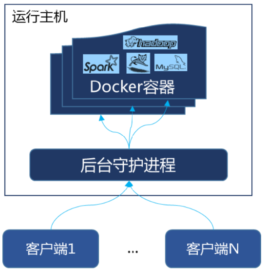
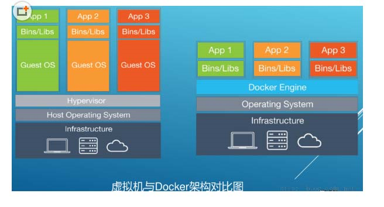

# docker 的原理

## 原理

Docker是一个Client-Server结构的系统，Docker守护进程运行在主机上， 然后通过Socket连接从客户端访问，守护进程从客户端接受命令并管理运行在主机上的容器。

容器，是一个运行时环境，就是我们前面说到的集装箱。

## docker 速度快的原因（面试题）

1. docker有着比虚拟机更少的抽象层。由亍docker不需要Hypervisor实现硬件资源虚拟化,运行在docker容器上的程序直接使用的都是实际物理机的硬件资源。因此在CPU、内存利用率上docker将会在效率上有明显优势。
2. docker利用的是宿主机的内核,而不需要Guest OS。因此,当新建一个容器时,docker不需要和虚拟机一样重新加载一个操作系统内核。仍而避免引寻、加载操作系统内核返个比较费时费资源的过程,当新建一个虚拟机时,虚拟机软件需要加载Guest OS,返个新建过程是分钟级别的。而docker由于直接利用宿主机的操作系统,则省略了返个过程,因此新建一个docker容器只需要几秒钟。

docker与虚拟机架构对比

| 参考点   | docker容器             | 虚拟机                     |
| -------- | ---------------------- | -------------------------- |
| 操作系统 | 与宿主机共享os         | 宿主机上面单独运行虚拟机os |
| 存储大小 | 镜像小，便于存储于传输 | 镜像庞大                   |
| 运行性能 | 较少额外性能损耗       | 需要额外的CPU，内存损耗    |
| 移植性   | 轻便，灵活             | 笨重，与虚拟化技术耦合度高 |
| 硬件方面 | 面向软件开发者         | 面向硬件运维者             |
| 部署速度 | 快速，秒级             | 缓慢，分钟级               |
