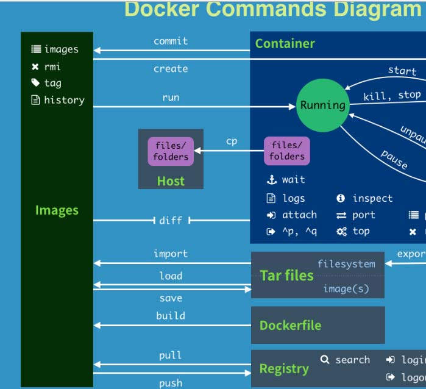

# docker的常用命令

## 帮助命令

| 项次 | 命令           | 说明 |
| :--- | -------------- | ---- |
| 1    | docker info    |      |
| 2    | docker version |      |
| 3    | docker --help  |      |

## 镜像命令

| 项次 | 命令                 | 说明                                                         |
| ---- | -------------------- | ------------------------------------------------------------ |
| 1    | docker images        | 列出本所有镜像的信息；同一仓库源可以有多个 TAG，代表这个仓库源的不同个版本，我们使用 REPOSITORY:TAG 来定义不同的镜像。option 说明： -a 列出所有; -q 只显示镜像id；--digests:显示镜像的摘要信息；--no-trunc :显示完整的摘要信息 |
| 2    | docker search 镜像名 | option 说明：--no-trunc:显示完整的镜像信息；-s：列出收藏数不小于指定值的镜像；--automated: 只列出automated build 类型的镜像                                                            |
| 3     |  docker pull 镜像的名字:[tag名字]                    | 下载镜像，如果不指定tag名字，默认是latest；[tag名字] 就是版本号                                                             |
| 4     |  docker rmi 镜像的名字id                    | 删除镜像，删除单个：docker rmi -f  镜像的名字 or id；删除多个： docker rmi -f  镜像的名字id1:tag1  镜像的名字:tag2 ；删除所有：docker rmi -f ${docker images -qa}                                                |

## 容器命令

先有镜像，然后才会有容器

| 项次 | 命令                 | 说明                                                         |
| ---- | -------------------- | ------------------------------------------------------------ |
| 1    | docker run        | 新建并启动容器；docker run [OPTION] IMAGE [COMMAND] [ARG...]，option 说明： --name="容器新名字": 为容器指定一个名称; -d: 后台运行容器，并返回容器ID，也即启动守护式容器；-i：以交互模式运行容器，通常与 -t 同时使用；-t：为容器重新分配一个伪输入终端，通常与 -i 同时使用；-P: 随机端口映射；-p: 指定端口映射，有以下四种格式：1.ip:hostPort:containerPort 2.ip::containerPort 3.hostPort:containerPort 4.containerPort |
| 2    | docker ps [OPTION] | option 说明：-a :列出当前所有正在运行的容器+历史上运行过的；-l :显示最近创建的容器；-n：显示最近n个创建的容器。；-q :静默模式，只显示容器编号。--no-trunc:不截断输出；                                                           |
| 3     |  exit                    | 容器停止并退出容器                  |
| 4     |  ctrl+P+Q                | 容器不停止退出                      |  
| 5    |  docker start 容器名 or容器id                |     启动容器              |  
| 6    |  docker restart 容器名 or容器id                |    重启启动容器          |  
| 7    |  docker stop 容器名 or容器id               |     停止容器            |  
| 8    |  docker kill 容器名 or容器id                |     强制停止容器          |  
| 9    |  docker rm 容器名 or容器id           |   删除已经停止的容器      |  
| 10    |  docker rm -f ${docker ps -a -q}     |  一次性删除所有容器      |  
| 11    |  docker ps -a -q \| xargs docker rm     |  一次性删除所有容器      |  
| 12    |  docker network create 网络名字       |  创建网络名字 ;     |  
| 13    |  docker logs -f -t --tail 数字 容器名 or容器id  |  显示容器的日志 ; -t：加入时间戳  -f：跟随最后的日志打印；--tail 数字:显示最后多少条  |  
| 14    |  docker top 容器名 or容器id  |  查看容器内运行的进程 ;  |  
| 15    |  docker inspect 容器名 or容器id  |  查看容器内的详细信息 ;  |  
| 16    |  docker exec -it 容器名 or容器id /bin/bash  |  重新进入正在运行的容器，并且打开新的终端，并执行后面跟的命令 ，可以启动新的进程; 推荐使用  |  
| 17    |  docker attach 容器名 or容器id  |  重新进入容器的终端，不会启动新的进程；  |  
| 18    |  docker cp 容器id:容器内的文件路径 目的主机的目录路径  |  从容器中向目的主机中拷贝文件  |  
| 19    |  docker cp 目的主机的文件路径 容器id:容器内的目录路径  |  从目的主机向容器中拷贝文件  |  

## 小结



```shell
attach    Attach to a running container                 # 当前 shell 下 attach 连接指定运行镜像
build     Build an image from a Dockerfile              # 通过 Dockerfile 定制镜像
commit    Create a new image from a container changes   # 提交当前容器为新的镜像
cp        Copy files/folders from the containers filesystem to the host path   #从容器中拷贝指定文件或者目录到宿主机中
create    Create a new container                        # 创建一个新的容器，同 run，但不启动容器
diff      Inspect changes on a container's filesystem   # 查看 docker 容器变化
events    Get real time events from the server          # 从 docker 服务获取容器实时事件
exec      Run a command in an existing container        # 在已存在的容器上运行命令
export    Stream the contents of a container as a tar archive   # 导出容器的内容流作为一个 tar 归档文件[对应 import ]
history   Show the history of an image                  # 展示一个镜像形成历史
images    List images                                   # 列出系统当前镜像
import    Create a new filesystem image from the contents of a tarball # 从tar包中的内容创建一个新的文件系统映像[对应export]
info      Display system-wide information               # 显示系统相关信息
inspect   Return low-level information on a container   # 查看容器详细信息
kill      Kill a running container                      # kill 指定 docker 容器
load      Load an image from a tar archive              # 从一个 tar 包中加载一个镜像[对应 save]
login     Register or Login to the docker registry server    # 注册或者登陆一个 docker 源服务器
logout    Log out from a Docker registry server          # 从当前 Docker registry 退出
logs      Fetch the logs of a container                 # 输出当前容器日志信息
port      Lookup the public-facing port which is NAT-ed to PRIVATE_PORT    # 查看映射端口对应的容器内部源端口
pause     Pause all processes within a container        # 暂停容器
ps        List containers                               # 列出容器列表
pull      Pull an image or a repository from the docker registry server   # 从docker镜像源服务器拉取指定镜像或者库镜像
push      Push an image or a repository to the docker registry server    # 推送指定镜像或者库镜像至docker源服务器
restart   Restart a running container                   # 重启运行的容器
rm        Remove one or more containers                 # 移除一个或者多个容器
rmi       Remove one or more images             # 移除一个或多个镜像[无容器使用该镜像才可删除，否则需删除相关容器才可继续或 -f 强制删除]
run       Run a command in a new container              # 创建一个新的容器并运行一个命令
save      Save an image to a tar archive                # 保存一个镜像为一个 tar 包[对应 load]
search    Search for an image on the Docker Hub         # 在 docker hub 中搜索镜像
start     Start a stopped containers                    # 启动容器
stop      Stop a running containers                     # 停止容器
tag       Tag an image into a repository                # 给源中镜像打标签
top       Lookup the running processes of a container   # 查看容器中运行的进程信息
unpause   Unpause a paused container                    # 取消暂停容器
version   Show the docker version information           # 查看 docker 版本号
wait      Block until a container stops, then print its exit code   # 截取容器停止时的退出状态值
```
