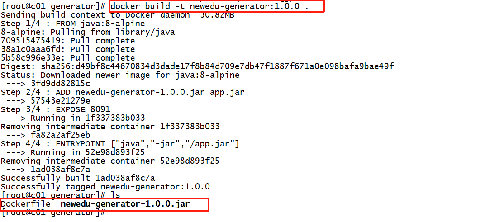
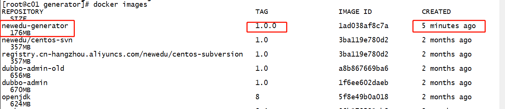
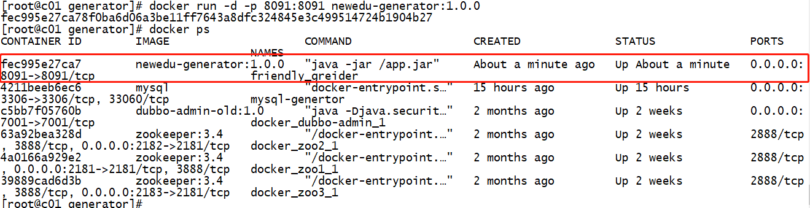

# docker镜像发布到阿里云

## 示意图


## 创建镜像

1. 从Dockerfile 来
2. 从现有的镜像中来

创建Dockerfile文件

```Dockerfile
FROM java:8-alpine
ADD newedu-generator-1.0.0.jar app.jar
EXPOSE 8091
ENTRYPOINT ["java","-jar","/app.jar"]
```

Dockerfile为将应用打成镜像的配置文件.

具体说下文件中的各个命令解释:

+ FROM  指定构成镜像的基础镜像源，可以在[官方网站](https://hub.docker.com)上找 如这个项目需要依赖jdk环境  镜像跟上版本号
+ ADD  复制本地文件到目标容器的系统文件中;newedu-generator-1.0.0.jar 是maven为Springboot打包生产的jar包
+ EXPOSE  容器对外映射的端口
+ ENTRYPOINT  配置容器启动后执行的命令

接着我们来构建镜像
将Dockerfile 和要使用到的jar包放到同一个目录下

输入docker build -t 跟你想要的镜像名称

```shell
docker build -t newedu-generator:1.0.0 .
```

从容器创建一个新的镜像
docker commit [OPTIONS] 现有的容器ID [REPOSITORY[:TAG]]

```shell
docker commit -a "jerrychen" -m "test mysql 001" f4a6d426b34c mysql:v5.7
```



输入docker images查看本地镜像仓库是否已经有了



运行一下看看我们自己打包的docker 镜像

```shell
docker run -d -p 8091:8091 newedu-generator:1.0.0

```




## 推送到阿里云

1. 在[阿里云平台](https://promotion.aliyun.com/ntms/act/kubernetes.html)注册账号
2. 创建仓库镜像，[控制台地址](https://cr.console.aliyun.com/cn-hangzhou/repositories)
3. 查看目标镜像
4. 将镜像推送到阿里云
5. 公有云可查询到

```shell
docker login --username= registry.cn-hangzhou.aliyuncs.com
docker tag [IMAGEID] registry.cn-hangzhou.aliyuncs.com/newedu/javateam:[镜像版本号]
docker push registry.cn-hangzhou.aliyuncs.com/newedu/javateam:[镜像版本号]

其中[IMAGEID] 和[镜像版本号]，需要根据实际情况填写
```


从阿里云上面，拉取自己的镜像

sudo docker pull registry.cn-hangzhou.aliyuncs.com/newedu/javateam-mysql:v5.7