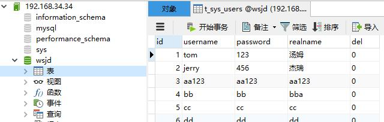
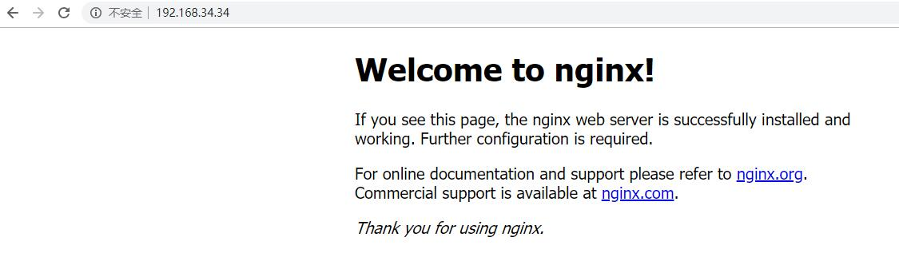
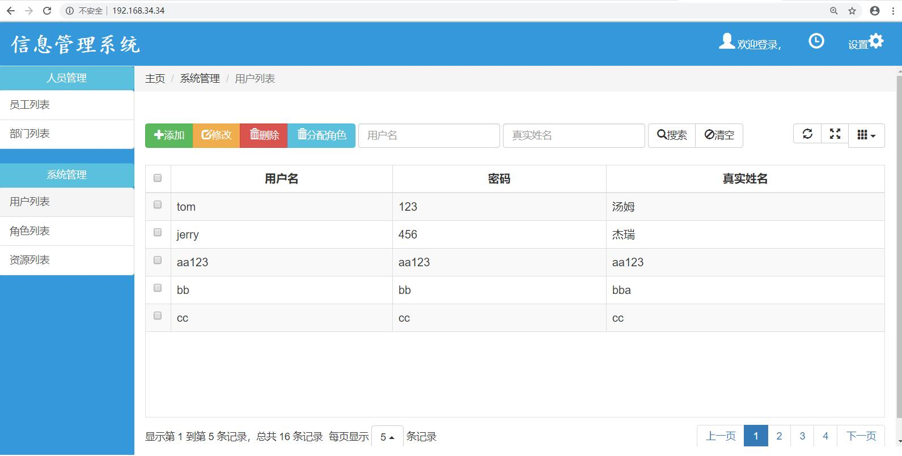

# docker 案例

## 1.下载指定镜像到本地docker中

```shell
## 下载mysql5.7
docker pull mysql:5.7

## 下载tomcat8.5，latest即可
docker pull tomcat

## 下载nginx1.14.2
docker pull nginx:1.14.2
```

查看镜像

```shell
[root@master-227f2c99545d4e34abf23b1a6710c33f ~]# docker images
REPOSITORY                                            TAG                 IMAGE ID            CREATED             SIZE
tomcat                                                latest              f1332ae3f570        3 weeks ago         463MB
mysql                                                 5.7                 98455b9624a9        3 weeks ago         372MB
nginx                                                 1.14.2              295c7be07902        3 weeks ago         109MB
```

### 2.创建数据卷目录和共用网络

```shell
##创建目录为数据卷使用
mkdir -p /root/mysql/conf
mkdir -p /root/mysql/logs
mkdir -p /root/mysql/data
mkdir -p /root/tomcat/webapps
mkdir -p /root/nginx/conf

##创建新网络
docker network create --driver=bridge new_net
```

## 3.创建容器时的选项

1.容器名称--name
2.后台运行-d
3.端口映射-p：容器端口与宿主机端口的映射
4.数据卷-v：tomcat容器可将项目发布目录制定数据卷，mysql容器可将配置、日志、表的文件制定数据卷
5.网络--network：创建新网络，将容器都添加都同一个网络中

## 4.创建mysql容器

```shell
##-e MYSQL_ROOT_PASSWORD=123456表示设置mysql root用户的初始密码为123456
docker run --name mysql -d -p 3306:3306 -v /root/mysql/conf:/etc/mysql/conf.d -v /root/mysql/logs:/logs -v /root/mysql/data:/var/lib/mysql -e MYSQL_ROOT_PASSWORD=123456 --network new_net mysql:5.7
```

将表结构与数据导入mysql



## 5.创建tomcat容器

创建5个tomcat容器，分别占用宿主机8081~8085端口

```shell
docker run --name tomcat1 -d -p 8081:8080 -v /root/tomcat/webapps:/usr/local/tomcat/webapps --network new_net tomcat

docker run --name tomcat2 -d -p 8082:8080 -v /root/tomcat/webapps:/usr/local/tomcat/webapps --network new_net tomcat

docker run --name tomcat3 -d -p 8083:8080 -v /root/tomcat/webapps:/usr/local/tomcat/webapps --network new_net tomcat

docker run --name tomcat4 -d -p 8084:8080 -v /root/tomcat/webapps:/usr/local/tomcat/webapps --network new_net tomcat

docker run --name tomcat5 -d -p 8085:8080 -v /root/tomcat/webapps:/usr/local/tomcat/webapps --network new_net tomcat
```

在/root/tomcat/webapps目录下创建demo目录并创建index.html测试


...


## 6.创建nginx容器

在/root/nginx/conf目录下建立nginx.conf配置文件，配置如下：

```shell
user  nginx;
worker_processes  1;

error_log  /var/log/nginx/error.log warn;
pid        /var/run/nginx.pid;

events {
    worker_connections  1024;
}

http {
    include       /etc/nginx/mime.types;
    default_type  application/octet-stream;

    log_format  main  '$remote_addr - $remote_user [$time_local] "$request" '
                      '$status $body_bytes_sent "$http_referer" '
                      '"$http_user_agent" "$http_x_forwarded_for"';

    access_log  /var/log/nginx/access.log  main;

    sendfile        on;
    #tcp_nopush     on;

    keepalive_timeout  65;

    #gzip  on;

    include /etc/nginx/conf.d/*.conf;
}
```

创建并启动nginx

```shell
docker run --name nginx -d -p 80:80 -v /root/nginx/conf/nginx.conf:/etc/nginx/nginx.conf --network new_net nginx:1.14.2
```



## 7.nginx代理tomcat

修改nginx的配置文件nginx.conf如下：

```shell
user  nginx;
worker_processes  1;

error_log  /var/log/nginx/error.log warn;
pid        /var/run/nginx.pid;

events {
    worker_connections  1024;
}

http {
    include       /etc/nginx/mime.types;
    default_type  application/octet-stream;

    log_format  main  '$remote_addr - $remote_user [$time_local] "$request" '
                      '$status $body_bytes_sent "$http_referer" '
                      '"$http_user_agent" "$http_x_forwarded_for"';

    access_log  /var/log/nginx/access.log  main;

    sendfile        on;
    #tcp_nopush     on;

    keepalive_timeout  65;

    #gzip  on;

    #include /etc/nginx/conf.d/*.conf;
    #添加代理的tomcat
    #其中tomcat1~5表示tomcat容器的网络别名，8080为每个容器的端口，并不是宿主的端口号
    upstream localhost {
      server tomcat1:8080 weight=4;
      server tomcat2:8080 weight=2;
      server tomcat3:8080 weight=1;
      server tomcat4:8080 weight=1;
      server tomcat5:8080 weight=1;
    }
    server {
      server_name localhost;
      listen 80;

     location / {
        proxy_pass http://localhost;
        proxy_set_header  X-Real-IP  $remote_addr;
        client_max_body_size 100m;
     }
   }
}
```

重启nginx容器测试

```shell
docker restart nginx
```


## 8.发布项目到tomcat

修改db.properties

```shell
#mysql
jdbc.mysql.driver=com.mysql.jdbc.Driver
##将localhost修改为mysql容器的网络别名
#jdbc.mysql.url=jdbc:mysql://localhost:3306/wsjd
jdbc.mysql.url=jdbc:mysql://mysql:3306/wsjd
jdbc.mysql.username=root
jdbc.mysql.password=123456

#druid
druid.initialSize=3
druid.minIdle=2
druid.maxActive=15
druid.maxWait=10000
```

在/root/tomcat/webapps建立ROOT目录，将项目打包发布至ROOT目录中，重启tomcat，访问nginx测试


